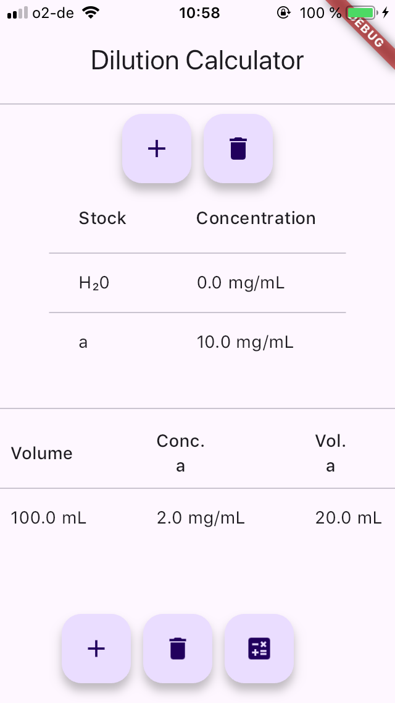
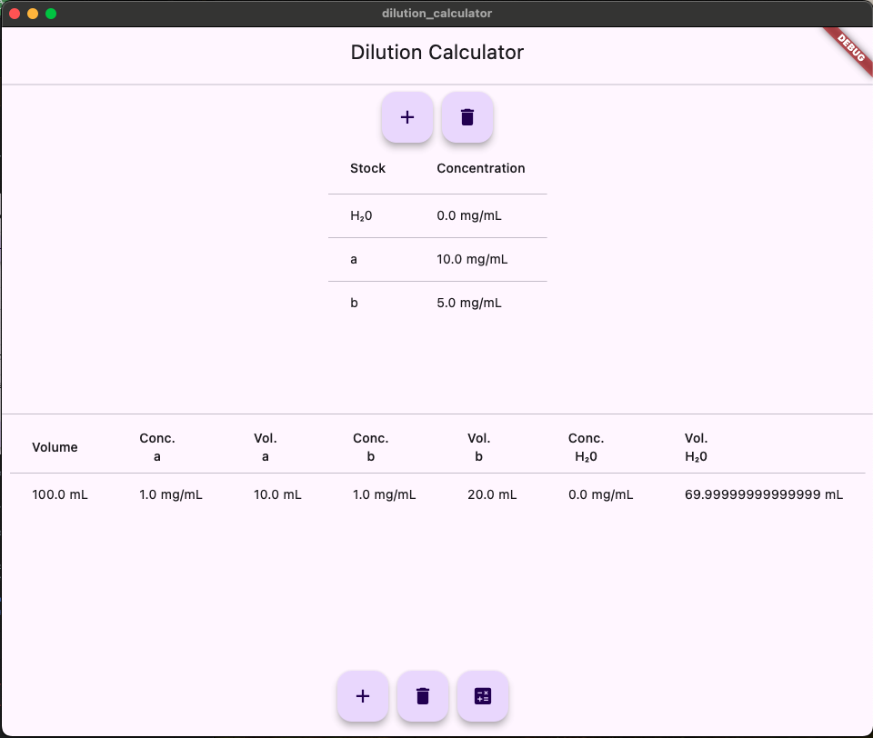

# dilution_calculator
A simple dilution calculator which uses the Dart equations LUSolver to calculate the volumes of stock solutions needed to create a desired dilution with specified concentration(s) of stock solutions.
No checking is performed and negative volumes can result when the input are not logical.






```md
Great idea! Let's modify the general formulation to always **include water (or another solvent)** as an additional stock solution.

### **Updated General Case with Water**
We now consider \( n \) stock solutions **plus water**, making the total number of components **\( n+1 \)**.

- **Stock solutions:**
  - Each stock solution \( i \) has a concentration **\( C_{i} \)**.
  - Volume used: **\( V_{i} \)**.

- **Water (or solvent):**
  - Water has **zero** concentration for all substances: \( C_{\text{water}, j} = 0 \).
  - Volume used: **\( V_w \)**.

- **Final mixture:**
  - The target concentration for each substance in the final solution is **\( C_j' \)**.
  - Total volume of the final solution: **\( V_f \)**.

### **Updated System of Equations**
For each **substance \( j \)**, the total amount in the final solution must match the total contributed by stock solutions:

\[
\sum_{i=1}^{n} C_{ij} V_i + C_{\text{water},j} V_w = V_f C_j'
\]

Since **water contains no solutes**, its concentration for any substance is **0**, so the equation simplifies to:

\[
\sum_{i=1}^{n} C_{ij} V_i = V_f C_j'
\]

**Total volume constraint:**
\[
\sum_{i=1}^{n} V_i + V_w = V_f
\]

### **Matrix Form with Water**
Now, our system can be written as:

\[
\begin{bmatrix} 
C_{11} & C_{21} & \dots & C_{n1} & 0 \\ 
C_{12} & C_{22} & \dots & C_{n2} & 0 \\ 
\vdots & \vdots & \ddots & \vdots & \vdots \\ 
C_{1m} & C_{2m} & \dots & C_{nm} & 0 \\ 
1 & 1 & \dots & 1 & 1
\end{bmatrix}
\begin{bmatrix} V_1 \\ V_2 \\ \vdots \\ V_n \\ V_w \end{bmatrix}
=
\begin{bmatrix} V_f C_1' \\ V_f C_2' \\ \vdots \\ V_f C_m' \\ V_f \end{bmatrix}
\]

### **Explanation of the Terms:**
- **Coefficient matrix \( A \)**:  
  - Same as before, but now with an extra **water column**, which has **0s** in the concentration rows and **1** in the volume row.

- **Unknown vector \( \mathbf{x} \)**:  
  \[
  \mathbf{x} =
  \begin{bmatrix} V_1 \\ V_2 \\ \vdots \\ V_n \\ V_w \end{bmatrix}
  \]
  This now includes the volume of water \( V_w \).

- **Right-hand side vector \( \mathbf{b} \)**:
  \[
  \mathbf{b} =
  \begin{bmatrix} V_f C_1' \\ V_f C_2' \\ \vdots \\ V_f C_m' \\ V_f \end{bmatrix}
  \]

### **Will This Work for \( n = 1 \)?**
Yes! If we only have **one stock solution and water** (\( n = 1 \)), our matrix equation reduces to:

\[
\begin{bmatrix} C_1 & 0 \\ 1 & 1 \end{bmatrix}
\begin{bmatrix} V_1 \\ V_w \end{bmatrix}
=
\begin{bmatrix} V_f C_1' \\ V_f \end{bmatrix}
\]

Solving:
1. From the second equation:  
   \[
   V_1 + V_w = V_f
   \]
   so \( V_w = V_f - V_1 \).

2. Substituting into the first equation:
   \[
   C_1 V_1 = V_f C_1'
   \]

   Solving for \( V_1 \):
   \[
   V_1 = \frac{V_f C_1'}{C_1}
   \]

3. Finally, compute \( V_w \):
   \[
   V_w = V_f - \frac{V_f C_1'}{C_1}
   \]

This means **if dilution is needed**, the system automatically accounts for it by adding water.

### **Summary:**
- This new formulation **always** works, even when \( n = 1 \), by allowing for dilution using water.
- The system **automatically finds the necessary water volume** if stock solutions alone cannot meet the target concentrations.
- The **total volume constraint ensures the final solution has the correct amount**.

Would you like a numeric example to test this out? 🚀
